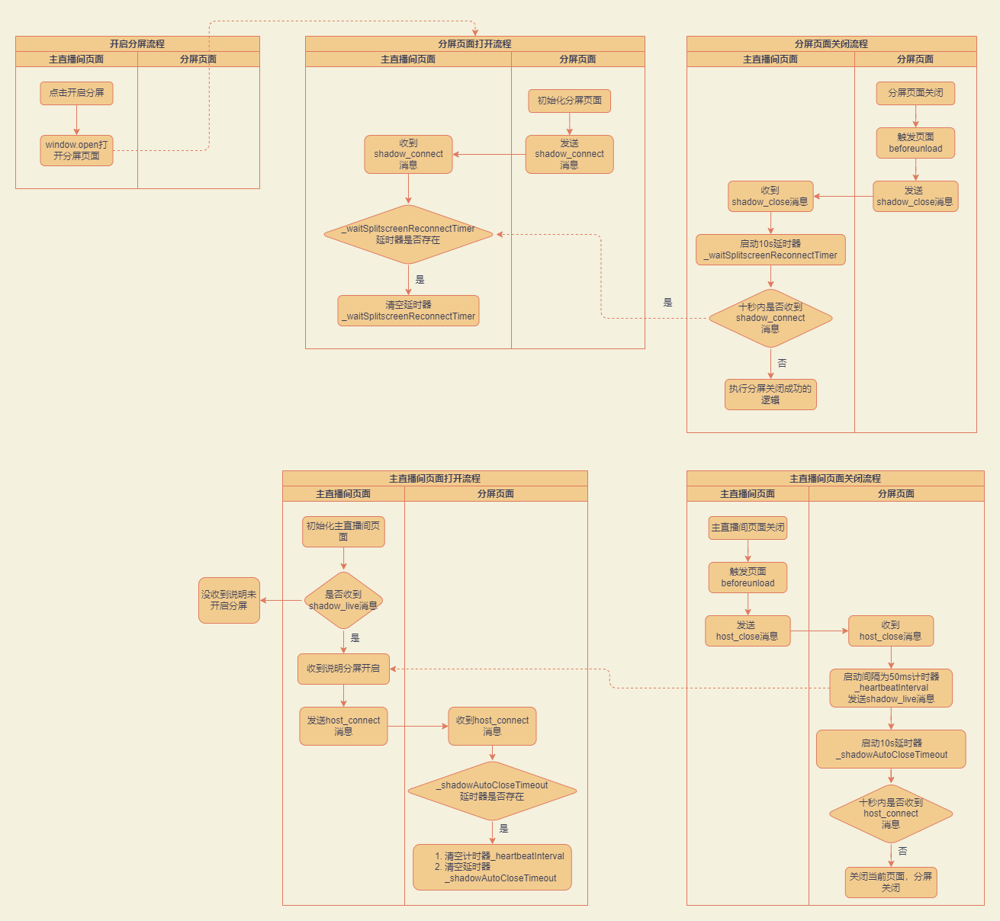

## 分屏

分屏的核心是调用了 `interactive.server` 的推拉流的能力、 `mic.server` 中维护的上下麦逻辑以及在 platform 侧引入对应的 `stream-local` 和 `stream-local` 组件实现页面推拉流的能力。
而 `splitScreen.server` 是用来实现除了上下麦之外的分屏中的接口，主要集中在主直播间页面与分屏页面的 `postMessage` 通信。

### 技术能力点

- `window.postMessage` 跨源通信

参考文档地址：https://developer.mozilla.org/zh-CN/docs/Web/API/Window/postMessage

### postMessage 消息设计

```js
// 发送消息
targetWin.postMessage(
  {
    type: 'shadow_disconnect', // 自定义业务事件类型
    source_type: 'split_screen' // 声明当前消息是在分屏功能中发出的，防止其他功能也使用 postMessage 会出现消息混乱的问题
  },
  this.curOrigin // 保证通信的安全性，指定 targetOrigin
);

// 接收消息
currentWin.onmessage = e => {
  // 是否是可以信任的来源
  if (e.origin !== this.curOrigin) {
    return;
  }
  // 是否是分屏服务的消息
  if (e.data.source_type != 'split_screen') {
    return false;
  }
  // 通过不同的消息类型处理对应业务逻辑
  switch (e.data.type) {
    case 'host_connect':
      // do what you want to do
      break;
    case 'shadow_stop':
      // do what you want to do
      break;
  }
};
```

### 事件列表

下面出现的“主页面”均指“主直播间页面”

| 事件类型                           | 事件名称           | 事件描述                                                                               |
| ---------------------------------- | ------------------ | -------------------------------------------------------------------------------------- |
| host_connect                       | 主页面连接成功     | 进入到主页面的时候向分屏页面发送的消息（如：用户刷新主页面的时候会触发）               |
| shadow_stop                        | 主页面点击关闭分屏 | 在主页面点击关闭分屏按钮时向分屏页面发送的消息                                         |
| host_close                         | 主页面关闭         | 关闭主页面的时候向分屏页面发送的消息（如：用户刷新主页面的时候会触发）                 |
| shadow_live                        | 分屏页面存活消息   | 当主页面关闭后重新打开的时候，分屏页面向主页面发送的消息，用于主页面获取分屏页面的引用 |
| shadow_connect                     | 分屏连接成功       | 进入分屏页面的时候向主页面发送的消息                                                   |
| shadow_disconnect                  | 关闭分屏           | 当分屏功能关闭的时候分屏页面向主页面发送的消息                                         |
| shadow_close                       | 分屏页面关闭       | 当关闭分屏页面的时候向主页面发送的消息                                                 |
| split_screen_remote_streams_update | 上麦列表更新事件   | 当上麦列表发生变化的时候，分屏页面通知主页面                                           |
| custom_msg                         | 预留自定义事件     | 供 domain 使用者自定义消息事件                                                         |

### 分屏事件流


